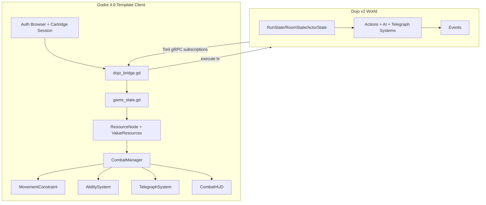

# Athanor v2 Implementation Plan

## Overview
Athanor v2 is a full redesign of the current PoC into a 2D isometric, grid-based tactical roguelike built on `nezvers/Godot-GameTemplate` with strict Dojo/Starknet onchain authority. The core shift is from simple cast/finish combat to positional, stamina-economy turns with delayed enemy telegraphs, fully onchain enemy AI, and template-native reactive resource architecture. This plan defines the implementation sequence, parallelization boundaries, validation gates, and risk controls for shipping an end-to-end playable vertical slice.

## Goals
- Replace v1 contract model with a fresh v2 onchain combat model (no backward compatibility).
- Implement simple deterministic enemy rules onchain (predictable movement, fixed targeting priority, archetype-specific attack patterns).
- Deliver the v2 tactical loop: grid movement + 5 starter abilities + delayed telegraph resolution.
- Build the client on Godot 4.6 + Godot-GameTemplate using ValueResource/ResourceNode signaling patterns.
- Migrate Dojo integration (`dojo_bridge.gd`, `game_state.gd`, auth stack) into template branch.
- Ship M1 vertical slice: 1 full room flow, 2 enemy archetypes, complete onchain turn loop and UX.

## Non-Goals
- Preserving v1 contracts or supporting live migration of existing v1 runs.
- Maintaining v1 3D rendering pipeline and GLB assets.
- Building final production-quality art pipeline in M1.
- Adding non-essential metagame systems (loot economy, progression trees, multiplayer, leaderboard).
- Introducing custom global architecture outside template reactive patterns.

## Assumptions and Constraints
- **Locked decisions (final):**
  - Fully onchain game logic remains mandatory.
  - Movement is grid-discrete with smooth lerp visuals and WASD input feel.
  - Telegraph timing follows Into-the-Breach model: created in Enemy Phase N, resolved at start of Enemy Phase N+1.
  - Enemy AI uses simple deterministic rules onchain (not full pathfinding/heuristics — Into the Breach style).
  - Turn timer is unlimited.
  - Starter ability set is fixed for M1: Strike, Dash, Cleave, Fireball, Guard.
  - Contract migration is a fresh break (v2 replaces v1).
  - M1 target is a vertical slice (1 room, 2 enemy archetypes, full onchain loop).
- Godot target version is 4.6 and template compatibility is mandatory.
- GDScript only.
- Dojo bridge/state/auth migration is non-negotiable.
- Template hard rules remain in force:
  - No template script/scene deletions.
  - No new autoloads.
  - Use arena (`fight_mode`, `ArenaStarter`, `ArenaDoorBlock`) as combat foundation.
  - Damage must flow through template chain.
  - Use tile collision/navigation systems.
  - Do not modify `great_games_library`.

## Requirements

### Functional
- Fresh v2 contract surface for positional tactical combat.
- Player can sequence multiple movement/ability actions in one player phase based on stamina.
- Stamina pays for movement and abilities.
- 5 player abilities implemented with full targeting/preview/commit lifecycle:
  - **Strike:** single-target melee.
  - **Dash:** line movement plus optional impact hit.
  - **Cleave:** cone AOE.
  - **Fireball:** positional radius AOE.
  - **Guard:** self-centered defensive buff reducing next enemy-phase damage.
- Enemy telegraphs are persisted onchain and resolved one enemy phase later.
- Simple deterministic enemy behavior per archetype (predictable rules the player can learn and exploit).
- Room flow from explore to combat to clear to transition.
- Client receives onchain state via Torii and renders combat state reactively.

### Non-Functional
- Deterministic and replay-safe contract outcomes.
- Strict client separation of concerns:
  - Onchain state authority in contract.
  - `dojo_bridge` for tx/subscriptions.
  - `game_state` for parsed entity state.
  - presentation systems consume resources/signals only.
- Strong test coverage for state transitions and invariants.
- Graceful auth/session recovery and reconnect behavior.
- Maintainable phase decomposition for parallel team execution.

## Technical Design

### Data Model

#### Contract entities (Dojo v2)
- `RunState(player, game_id)`
  - `phase` (Explore, PlayerTurn, EnemyTurn, Complete, Failed)
  - `room_id`
  - `turn_index`
  - `player_actor_id`
  - `status_flags`
- `RoomState(player, game_id, room_id)`
  - grid dimensions: **8×8 tiles** (u8 width/height)
  - blocked bitmap: `u64` (64 bits — fits in a single felt252, 1 bit per tile)
  - occupancy bitmap: `u64` (same — 1 bit per tile)
  - room completion flags
  - entry/exit metadata
- `ActorState(player, game_id, actor_id)`
  - faction, archetype, hp/max_hp, stamina/max_stamina
  - offense/defense/speed/move_cost
  - `pos_x`, `pos_y`, alive/dead flag
  - active buffs/debuffs (including Guard-derived damage reduction)
- `AbilitySlotState(player, game_id, actor_id, slot_index)`
  - `ability_id`
  - `cooldown_remaining`
- `TelegraphState(player, game_id, telegraph_id)`
  - source actor
  - shape type and packed params
  - created turn / resolves turn
  - active/resolved/cancelled state
- ~~`AIBrainState`~~ — **Removed.** Simple deterministic rules need no persistent AI memory. Enemy behavior is fully determined by current ActorState positions + archetype rules.

#### Event model
- `RunSpawnedV2`, `RoomEnteredV2`, `ActorMoved`, `AbilityUsed`, `GuardApplied`, `TelegraphCreated`, `TelegraphResolved`, `EnemyTurnComputed`, `TurnEnded`, `ActorDamaged`, `ActorDied`, `RoomCleared`, `RunCompleted`, `RunFailed`.

#### Invariants
- Every telegraph has exactly one resolve path at `resolves_turn`.
- Enemy choices follow simple deterministic rules onchain; no client-submitted enemy intent. Rules are predictable by design (Into the Breach model).
- Position legality and occupancy are enforced onchain before writes.
- `turn_index` strictly monotonic.

### API Design

#### v2 world/system actions
- `spawn_v2(class_id)`
- `enter_room_v2(game_id, room_id)`
- `move_v2(game_id, target_x, target_y)`
- `use_ability_v2(game_id, ability_id, target_mode, target_a, target_b)`
- `end_player_phase_v2(game_id)`
- `step_enemy_phase_v2(game_id)` *(if explicit phase step needed for sequencing/telegraph resolution)*

#### Ability targeting contract interface
- `target_mode` enum:
  - `SingleTargetActor`
  - `Directional`
  - `Positional`
  - `Self`
- `target_a`, `target_b` interpreted by mode (actor id, direction enum, x/y coordinates).

#### Versioning and replacement
- v2 is a breaking replacement; v1 actions/models are deprecated.
- New namespace and ABI surface for v2-only client.

### Filesystem Layout (Post-Scaffold)

After task 0.3, the repo structure will be:

```
athanor/
├── contracts/              ← v2 Cairo contracts (replaces v1 in-place)
│   └── src/
│       ├── models/         ← RunState, RoomState, ActorState, etc.
│       ├── systems/        ← actions_v2.cairo, ai.cairo, telegraph.cairo
│       ├── events/
│       ├── helpers/
│       └── tests/
├── dojo_v2.toml            ← v2 Dojo profile config
├── Scarb.toml
├── client/                 ← Godot 4.6 project (template fork replaces v1 3D client)
│   ├── project.godot
│   ├── addons/
│   │   ├── great_games_library/   ← template core (DO NOT MODIFY)
│   │   │   ├── resources/ValueResource/
│   │   │   └── nodes/ResourceNode/
│   │   └── top_down/              ← template game systems (adapt, don't delete)
│   │       └── scripts/
│   ├── scripts/
│   │   ├── autoload/              ← migrated: dojo_bridge.gd, game_state.gd, audio_manager.gd
│   │   ├── combat/                ← NEW: CombatManager, MovementConstraint, AbilitySystem, TelegraphSystem
│   │   ├── resources/             ← NEW: StaminaResource, CombatStatsResource, AbilityResource
│   │   └── ui/                    ← NEW: CombatHUD
│   ├── scenes/
│   │   ├── rooms/                 ← room .tscn files with TileMapLayer, ArenaStarter, SpawnPoints
│   │   └── test/                  ← debug/test scenes for QA harnesses
│   └── assets/
│       └── sprites/               ← 2D placeholder sprites (isometric 2:1)
├── client_v1/              ← archived v1 3D client (reference only, not built)
└── docs/
    ├── v2-domain-spec.md
    ├── v2-abi-spec.md
    └── v2-ai-determinism.md
```

The current `client/` directory is moved to `client_v1/` for reference. The template fork becomes the new `client/`. All QA paths reference `client/` as the Godot project root.

### Architecture



### UX Flow (if applicable)
1. Player authenticates with Cartridge in-client flow.
2. Player starts run and enters room.
3. Explore phase allows free positioning setup.
4. Combat trigger transitions to player phase (`fight_mode=true`).
5. Player spends stamina on movement and abilities in chosen order.
6. End player phase.
7. Enemy phase computes onchain:
   - resolves previous telegraphs at start of phase,
   - moves enemies,
   - selects/places new telegraphs for next cycle.
8. Client visualizes updates via subscription-driven resource signals.
9. Room ends with clear/fail; clear leads to transition.

---

## Implementation Plan

### Serial Dependencies (Must Complete First)

These tasks create foundations that other work depends on. Complete in order.

#### Phase 0: Foundation Reset (v2 Break)
**Prerequisite for:** All subsequent phases

| Task | Description | Output | QA |
|------|-------------|--------|----|
| 0.1 | Remove/deprecate v1 contract assumptions and define v2-only domain language (phases, abilities, telegraph timing) | `docs/v2-domain-spec.md` | Doc exists, contains: phase enum, ability enum, telegraph timing rule, grid dimensions (12×12), stamina costs table |
| 0.2 | Lock ABI/API and model schema for v2 actions/entities/events | `docs/v2-abi-spec.md` | Doc contains: all 6 action signatures, all entity schemas with field types, all 14 event definitions |
| 0.3 | Clone `nezvers/Godot-GameTemplate` into `client/`, move current client to `client_v1/`, verify template runs in Godot 4.6. Create `client/scenes/test/` directory for QA harness scenes. | v2 template branch scaffold | `ls client/addons/great_games_library/resources/ValueResource/ValueResource.gd` exists; `ls client/addons/top_down/scripts/arena/ArenaStarter.gd` exists; `cd client && godot --headless --quit` exits 0 |
| 0.4 | Define simple deterministic enemy rules per archetype. **Melee Brute**: move 1 tile toward nearest player (shorter axis first, break ties by X-axis), if adjacent → telegraph Strike on player tile. **Ranged Caster**: if distance < 3 move 1 tile away from player, if distance ≥ 3 stay, telegraph circle AOE centered on player's current tile. Target priority: nearest player, break ties by actor_id. | `docs/v2-enemy-rules.md` | Doc contains: per-archetype movement rule, attack rule, target priority rule, tie-break rule, example scenarios |
| 0.5 | Create v2 Dojo profile config (`dojo_v2.toml`) with v2 world address, namespace, and contract references | `dojo_v2.toml` in project root | `sozo build --profile v2` exits 0 (once contracts exist) |

#### Phase 1: Contract Engine Core
**Prerequisite for:** Workstreams A, B, C, D

| Task | Description | Output | QA |
|------|-------------|--------|----|
| 1.1 | Implement v2 entities (RunState, RoomState, ActorState, AbilitySlotState, TelegraphState, AIBrainState), events, and storage helpers | Compiling v2 contract base | `sozo build` exits 0; grep confirms all 6 models and 14 events defined |
| 1.2 | Implement `move_v2(game_id, target_x, target_y)` with Manhattan distance stamina cost, occupancy checks, blocked tile validation on 8×8 grid. Bitmaps are `u64` (bit index = y*8+x). | Deterministic movement subsystem | `sozo test -f test_move` — tests: valid move deducts stamina, blocked tile rejected, occupied tile rejected, out-of-stamina rejected, out-of-bounds (≥8) rejected |
| 1.3 | Implement `use_ability_v2` for Strike/Dash/Cleave/Fireball/Guard with targeting modes, stamina costs, cooldown tracking, and damage application | Ability subsystem complete | `sozo test -f test_ability` — tests per ability: correct stamina deduction, cooldown set, damage applied to targets in AOE, invalid target rejected, insufficient stamina rejected |
| 1.4 | Implement telegraph lifecycle: `TelegraphState` created with `resolves_turn = current_turn + 1`, resolved at start of next `step_enemy_phase_v2`, damage applied to actors in shape | Telegraph subsystem complete | `sozo test -f test_telegraph` — tests: telegraph created with correct resolves_turn, resolves on correct phase, damage applied to actors inside shape, actors outside shape unharmed |
| 1.5 | Implement simple deterministic enemy rules for 2 archetypes. **Brute**: move 1 tile toward player (shorter axis, X-axis tiebreak), if adjacent → create Strike telegraph on player tile. **Caster**: if dist < 3 move 1 tile away, else stay, create circle AOE telegraph on player tile. ~20 lines of Cairo per archetype. | Deterministic enemy rule subsystem | `sozo test -f test_enemy_rules` — tests: brute moves toward player on shorter axis, brute telegraphs when adjacent, caster retreats when close, caster telegraphs at range, deterministic replay (same state → same decisions), X-axis tiebreak verified |
| 1.6 | Implement phase orchestrator: `end_player_phase_v2` transitions to EnemyTurn, `step_enemy_phase_v2` resolves telegraphs then computes enemy actions, detects win/lose terminal states | Turn loop subsystem | `sozo test -f test_phase` — tests: phase transitions in correct order, telegraphs resolve before enemy actions, all-enemies-dead → RoomCleared, player-dead → RunFailed, turn_index increments |
| 1.7 | Build integration test suite: full room clear scenario (spawn → enter → move → ability → end phase → enemy phase → repeat → clear) and full room fail scenario | Green v2 contract suite | `sozo test` — all tests pass; integration tests cover complete room lifecycle |

---

### Parallel Workstreams

These workstreams can be executed independently after Phase 1.

#### Workstream A: Template Combat Runtime Systems
**Dependencies:** Phase 0.3 (template scaffold), Phase 1 (contract engine)
**Can parallelize with:** Workstreams B, C, D

| Task | Description | Output | QA |
|------|-------------|--------|----|
| A.1 | Add `StaminaResource` (extends IntResource, tracks current/max, signals on spend/refill/deplete) and `CombatStatsResource` (extends SaveableResource, holds offense/defense/speed/move_cost) following ValueResource pattern | `client/scripts/resources/stamina_resource.gd`, `client/scripts/resources/combat_stats_resource.gd` | `cd client && godot --headless --quit` exits 0; `grep -r "class_name StaminaResource" client/scripts/` finds file; resource registered in test scene ResourceNode |
| A.2 | Implement `MovementConstraint`: on player phase start, computes reachable tile set from AStarGrid2D + remaining stamina. WASD input moves player to adjacent tile with smooth lerp (0.15s). Draws reachable tiles as ground overlay. Shrinks on stamina spend. | `client/scripts/combat/movement_constraint.gd` | Create `client/scenes/test/test_movement.tscn` — 8×8 TileMapLayer + player with ResourceNode + MovementConstraint. Launch: `cd client && godot res://scenes/test/test_movement.tscn`. Verify: WASD moves one tile per press with lerp; unreachable tiles block; overlay shrinks on stamina spend; entire grid visible on screen without scrolling |
| A.3 | Implement `AbilityResource` (extends Resource — name, stamina_cost, cooldown_turns, target_mode, aoe_shape, base_damage, icon). Build targeting preview: select ability → mouse shows AOE shape on grid → click confirms → fires `use_ability_v2` tx | `client/scripts/resources/ability_resource.gd`, `client/scripts/combat/ability_system.gd` | Create `client/scenes/test/test_abilities.tscn` — grid + player + ability buttons. Launch: `cd client && godot res://scenes/test/test_abilities.tscn`. Verify: each of 5 abilities shows correct preview shape; click logs tx call; insufficient stamina greys out button |
| A.4 | Build `CombatManager`: listens to `fight_mode` BoolResource. On true: disables free movement, enters PlayerTurn phase. Reads `RunState.phase` from game_state to sync client phase with onchain phase. Manages transitions between PlayerTurn and EnemyTurn presentation. | `client/scripts/combat/combat_manager.gd` | Create `client/scenes/test/test_combat_loop.tscn` — room with ArenaStarter + player + mock enemies. Launch: `cd client && godot res://scenes/test/test_combat_loop.tscn`. Verify: walk into ArenaStarter → combat mode activates → End Turn sends tx → phase indicator switches → exit combat on clear |
| A.5 | Wire all ability damage through template's AreaTransmitter → DataChannelTransmitter → HealthResource chain. Ability visuals spawn Area2D shapes that feed into this existing chain. | Wiring in `client/scripts/combat/ability_system.gd` | Reuse `test_abilities.tscn`. Trigger Strike on an enemy with HealthResource. Verify: DamageDisplay shows floating number; VisualInvulnerability blinks target; CameraShakeResource fires (camera shakes). All 3 template systems confirmed. |

#### Workstream B: Dojo Bridge/State/Auth Migration
**Dependencies:** Phase 0.3 (template scaffold), Phase 1 (contract engine — for v2 model names/actions)
**Can parallelize with:** Workstreams A, C, D

| Task | Description | Output | QA |
|------|-------------|--------|----|
| B.1 | Port `dojo_bridge.gd` into template branch. Replace v1 action wrappers (spawn/choose/start/cast/finish) with v2 wrappers (spawn_v2/enter_room_v2/move_v2/use_ability_v2/end_player_phase_v2/step_enemy_phase_v2). Keep session/auth/burner logic intact. | v2 tx bridge | `godot --headless --quit` exits 0; grep for all 6 v2 action methods in dojo_bridge.gd; v1 methods removed |
| B.2 | Port `game_state.gd` to parse v2 entities: RunState, RoomState, ActorState, AbilitySlotState, TelegraphState. Add signals: `run_updated`, `room_updated`, `actor_updated`, `telegraph_updated`. | v2 parsed state layer | `godot --headless --quit` exits 0; all 5 v2 signals defined; `_handle_entity_payload` parses v2 model names |
| B.3 | Port auth systems (`auth_browser.gd`, Controller flow, session cache) unchanged. Wire into template's main scene tree. Verify embedded CEF and fallback OS.shell_open paths. | Auth parity in template client | Manual test: launch client → "Connect" button → CEF browser opens Cartridge auth → complete auth → session_ready signal fires → player address shown |
| B.4 | Rebuild Torii subscriptions for v2 entity models (RunState, RoomState, ActorState, AbilitySlotState, TelegraphState). Add KeysClause with v2 model names. Verify reconnect on disconnect. | Stable live sync layer | Manual test: start local stack (katana + torii); client connects; submit move_v2 tx via sozo; verify ActorState.pos_x/pos_y update appears in client within 3s |

#### Workstream C: Telegraph + Enemy Visualization
**Dependencies:** Phase 0.3 (template scaffold), Phase 1 (contract engine — for TelegraphState schema)
**Can parallelize with:** Workstreams A, B, D

| Task | Description | Output | QA |
|------|-------------|--------|----|
| C.1 | Build `TelegraphSystem`: renders 4 shape types (circle/line/cone/rect) as colored tile overlays on the isometric grid. Reads TelegraphState from game_state. Shape params decoded from packed onchain data. | `client/scripts/combat/telegraph_system.gd` | Create `client/scenes/test/test_telegraphs.tscn` — 8×8 grid + script that injects mock TelegraphState dicts into game_state for each shape type. Launch: `cd client && godot res://scenes/test/test_telegraphs.tscn`. Verify: 4 shapes render on correct grid tiles with correct colors; all telegraphs visible simultaneously on single screen. |
| C.2 | Implement N→N+1 visualization states: telegraph appears with "pending" opacity (0.4) during enemy phase, pulses to "resolving" (1.0) at start of next enemy phase before damage applies, then fades out after resolution. | State logic in `telegraph_system.gd` | Extend `test_telegraphs.tscn` with a mock turn_index incrementer (button or timer). Verify: telegraph at opacity 0.4 → increment turn_index → telegraph pulses to 1.0 → fades out. Opacity values verifiable via inspector. |
| C.3 | Wire enemy sprite movement and attack animations to onchain ActorState updates only. Enemy position lerps to new pos_x/pos_y when ActorState changes. Attack animation triggers on AbilityUsed event for enemy actors. | Enemy visual sync in `client/scripts/combat/enemy_visual.gd` | Extend `test_combat_loop.tscn`. After enemy phase tx, verify: enemy sprite lerps to new grid position over 0.2s; attack animation plays; no movement occurs without onchain state change. |
| C.4 | Build debug overlay (toggle with F3) showing AStarGrid2D walkable/blocked tiles, actor positions, telegraph shapes, and turn_index — useful for validating client matches contract | `client/scripts/combat/debug_overlay.gd` | Launch any test scene, press F3. Verify: overlay toggles on/off; blocked tiles red; walkable tiles green; actor positions show as labeled dots at grid coords; turn_index displayed in corner. |

#### Workstream D: HUD + Isometric 2D Asset Transition
**Dependencies:** Phase 0.3 (template scaffold), Phase 1 (contract engine — for resource schemas)
**Can parallelize with:** Workstreams A, B, C

| Task | Description | Output | QA |
|------|-------------|--------|----|
| D.1 | Build `CombatHUD`: bottom bar (HP bar from HealthResource, stamina bar from StaminaResource, 5 ability buttons showing cost/cooldown/icon, "End Turn" button, turn phase indicator). Top bar (zone name, hovered enemy info). | M1 tactical HUD | Manual test: HP bar reflects HealthResource; stamina bar reflects StaminaResource; ability buttons show correct costs; cooldown numbers decrement each turn; End Turn button calls end_player_phase_v2; phase indicator shows "Your Turn" / "Enemy Turn" |
| D.2 | Build movement range overlay (reachable tiles highlighted in blue based on remaining stamina + AStarGrid pathfinding) and AOE preview overlay (ability shape shown on grid following mouse, snapping to tile centers). | Decision support UI | Manual test: reachable tiles highlight on player phase start; highlight shrinks after movement; AOE preview follows mouse snapped to grid; preview disappears after ability confirms or cancels |
| D.3 | Create 2D sprite placeholders for: player (idle/walk/attack/hit/death), Melee Brute (idle/walk/attack/hit/death), Ranged Caster (idle/walk/attack/hit/death). Use template's SpriteFrames format. Isometric 2:1 perspective. | M1 visual asset baseline | Sprites load without error; all 5 animation states exist per character; `godot --headless --quit` exits 0 |
| D.4 | Define production sprite pipeline contract: atlas naming convention, pivot points for isometric alignment, layer ordering for depth sorting, animation frame counts and timing. | `docs/v2-art-spec.md` | Doc contains: naming convention, pivot spec, layer ordering rules, frame count table per animation state |

---

### Merge Phase

After parallel workstreams complete, these tasks integrate the work.

#### Phase N: Vertical Slice Integration (M1)
**Dependencies:** Phase 0.3 (template scaffold), Phase 1 (contract engine), Workstreams A, B, C, D

| Task | Description | Output | QA |
|------|-------------|--------|----|
| N.1 | Integrate explore/combat/clear flow in a single room: SceneEntry spawns player, free WASD explore, ArenaStarter triggers combat, CombatManager runs turn loop, enemy_count=0 triggers fight_mode=false, ArenaDoorBlock unblocks exit | `client/scenes/rooms/room_m1.tscn` | Launch: `cd client && godot res://scenes/rooms/room_m1.tscn` (with local stack running). Walk freely → enter ArenaStarter → combat activates → complete turns → room clears → exit door unblocks. |
| N.2 | Configure 2 enemy archetypes (Melee Brute + Ranged Caster) with distinct onchain AI, telegraph shapes, and spawn positions on the 12×12 grid. Wire EnemyWaveManager spawn data. | Enemy config in room_m1.tscn + contract archetype data | Launch room_m1.tscn with local stack. Verify: brute moves toward player and telegraphs adjacent strike; caster maintains 4+ tile distance and telegraphs radius AOE; both telegraph shapes render on grid; damage resolves on next enemy phase. |
| N.3 | Run full E2E acceptance loop: start local stack (`katana --dev --dev.no-fee && sozo migrate --profile v2 && torii --world <ADDR> --rpc http://localhost:5050`) → launch client (`cd client && godot`) → Cartridge auth or burner → spawn_v2 → enter_room_v2 → tactical combat → room clear → end screen | M1 acceptance run | Full loop completes without crash; Torii entity updates arrive within 3s; all 5 abilities usable with correct targeting; telegraph N→N+1 timing correct; test both win path (kill all enemies) and lose path (player HP=0). |
| N.4 | Produce release-ready validation report documenting: tested scenarios, known issues, performance notes, next milestone scope | `docs/m1-acceptance-report.md` | Report covers: E2E test results, list of known issues with severity, performance observations, M2 scope recommendations |

---

## Testing and Validation

- **Contract tests**
  - Unit tests for each ability target mode and stamina/cooldown rules.
  - Unit tests for telegraph create/resolve lifecycle (N->N+1 invariant).
  - Unit tests for guard buff damage reduction window semantics.
  - Unit tests for enemy rule determinism (same positions → same movement/telegraph, axis tiebreaks verified).
  - Integration tests for full room clear and fail conditions.
  - Replay tests: same initial state + actions => same outcomes/events.

- **Client tests**
  - Parse checks (`godot --headless --quit`).
  - Reactive signal tests (resource update propagation under rapid event bursts).
  - Manual tests for movement lerp fidelity and grid snap correctness.
  - Manual tests for ability previews and invalid-target feedback.
  - Manual tests for telegraph readability and delayed resolution clarity.

- **Network/integration tests**
  - Torii stream robustness during dense event windows.
  - Auth resume and session cache consistency across restarts.
  - Tx retry/failure UX on transient network faults.

## Rollout and Migration

- Fresh break strategy:
  - v2 contracts become canonical target.
  - v1 is retired from active development and gameplay target.
- Migration steps:
  1. Deploy v2 contracts and publish world metadata.
  2. Release v2 client pointing only to v2 namespace/actions.
  3. Archive v1 docs/tests as historical reference.
- Rollback plan:
  - Keep a tagged v1 release branch for emergency reference only.
  - For v2 regressions, hotfix v2; no functional rollback to v1 runtime.

## Verification Checklist

- Contract validation
  - `sozo build`
  - `sozo test`
  - Determinism fixture tests pass

- Local stack validation
  - `katana --dev --dev.no-fee`
  - `sozo migrate --profile v2` (uses `dojo_v2.toml` created in task 0.5)
  - `torii --world <V2_WORLD_ADDRESS> --rpc http://localhost:5050`

- Client validation
  - `cd client && godot --headless --quit`
  - Manual login/auth flow succeeds
  - Manual room run validates complete M1 loop

Expected success criteria:
- Enemy behavior follows simple deterministic rules, fully contract-generated, predictable by the player.
- Telegraph timing behavior matches N->N+1 rule in gameplay.
- All 5 abilities function with correct target modes and resource costs.
- One-room vertical slice with two enemy archetypes is playable end-to-end.
- Template architecture constraints remain intact.

## Risk Assessment

| Risk | Likelihood | Impact | Mitigation |
|------|------------|--------|------------|
| Enemy rule simplicity limits perceived depth | Low | Medium | Simple rules + multiple enemies + obstacles create emergent complexity. Add archetype variety post-M1 for more patterns. |
| Telegraph timing bugs create unfair damage perception | Medium | High | Encode explicit turn indices in telegraph model and render strictly from onchain fields |
| Contract/client legality mismatch for pathing/LOS | Medium | High | Build shared fixture maps and verification tests consumed by both contract tests and client debug view |
| Migration friction of Dojo bridge/auth in template architecture | Medium | High | Isolate migration in dedicated workstream, add smoke harness early |
| 2D asset replacement slows gameplay integration | High | Medium | Lock placeholder sprite pack and animation naming before polish pass |
| Event volume spikes degrade client responsiveness | Medium | Medium | Batch parse updates in `game_state`, throttle non-critical visual effects |

## Open Questions

- [x] Combat grid size: **8×8 tiles** (64 tiles, ~20 obstacle tiles for ~30% coverage, blocked/occupancy bitmaps fit in single `u64`).
- [x] Enemy archetype definitions: **Melee Brute** (move 1 tile toward player, telegraph Strike when adjacent) and **Ranged Caster** (maintain distance ≥ 3, telegraph circle AOE on player). Simple deterministic rules, ~20 lines Cairo each.
- [x] Guard stacking policy: **Refresh** — reapplying Guard resets the buff duration, does not stack. Simplest, no degenerate strategies.
- [x] Dash collision: **Stops at last unoccupied tile** in the line. If all tiles occupied, Dash fails (stamina not spent).
- [x] Combat transition: When combat triggers, player position **snaps to nearest tile center** before first player phase begins.
- [ ] Post-M1 dungeon graph expansion shape and room modifier system (intentionally deferred).

## Decision Log

| Decision | Rationale | Alternatives Considered |
|----------|-----------|------------------------|
| Fresh break v2 contracts (replace v1) | Reduces migration complexity and enables clean tactical architecture | Parallel maintain v1 + v2, in-place migration |
| Simple deterministic enemy rules onchain (not full AI) | Predictable enemies create better tactical depth (Into the Breach model). ~20 lines Cairo per archetype vs weeks for full AI. Still fully deterministic and verifiable. | Fully onchain AI (too complex for M1), hybrid client-submitted (trust issues) |
| Telegraph N create / N+1 resolve | Makes positioning core skill expression and tactical clarity | Same-phase resolve |
| Unlimited player turn timer | Preserves deep tactical planning pace | Soft/hard timers |
| Starter ability set fixed to Strike/Dash/Cleave/Fireball/Guard | Covers all four target modalities and tactical roles | Smaller or alternative starter kits |
| M1 as one-room vertical slice with 2 enemy archetypes | Validates complete loop quickly while containing scope | Contract-only milestone, sandbox without room flow |
| Template reactive architecture as foundation | Aligns with existing robust systems and minimizes bespoke glue | Custom architecture rewrite |
| 8×8 combat grid (changed from 12×12) | Into the Breach density for telegraph-based combat; fits single screen; bitmaps fit in `u64`; puzzle-tight with 1 player vs 2-4 enemies + ~20 obstacles | 10×10 (spacious middle-ground), 12×12 (too sparse — 29+ tiles/unit) |
